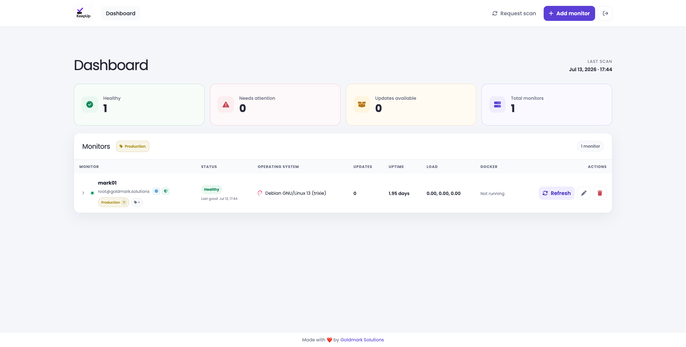
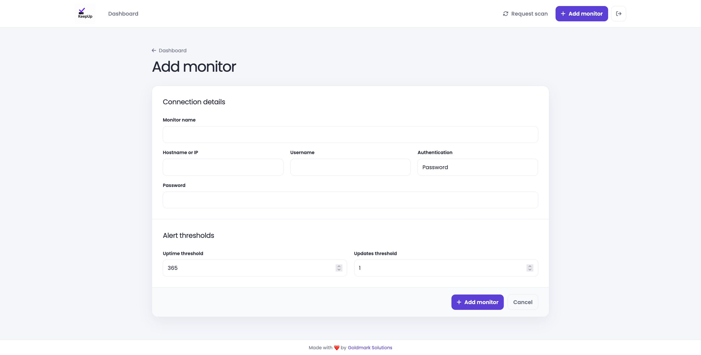

# KeepUp

KeepUp is a self-hosted, agentless dashboard for monitoring Linux and Windows servers over SSH. It collects a concise operational snapshot from each server and keeps health, pending updates and resource information in one place.

## Screenshots

### Dashboard



### Add a monitor



## Features

### Server monitoring

- Add, edit and delete monitored servers.
- Connect over SSH using a password or private key.
- Reuse an encrypted private key across multiple monitors.
- Scan every monitor on demand or request a scan for one specific monitor.
- Run scheduled scans daily at `08:00` in the application's configured timezone.
- Automatically refresh the dashboard every five minutes.
- Optionally send Telegram alerts after scans when a monitor is unreachable or reaches an uptime or available-updates threshold.

For each supported server, KeepUp collects:

- Distribution name and full operating-system version.
- Uptime in days.
- Number of available package updates.
- IPv4 addresses reported by the server.
- CPU load averages.
- Disk usage and available space.
- Whether the Docker daemon is running and how many containers are active.
- UFW status and rules when UFW is installed and accessible to the SSH user.

### Dashboard

- At-a-glance totals for healthy monitors, unreachable monitors, available updates and all monitors.
- Per-monitor warning thresholds for uptime and available updates.
- Clear indicators when a server reports a public IP and whether UFW appears active.
- Expandable technical details for network addresses, firewall rules and disk usage.
- Alphabetical monitor ordering.
- Multiple labels per monitor, with deterministic label colors and toggleable dashboard filters.
- Last scan time plus successful-check snapshots of uptime, available updates and scan duration.

### Credential protection

- SSH passwords are encrypted at rest with Laravel's application encryption key.
- Uploaded private keys are encrypted before being written to private storage.
- A private key is decrypted into a temporary permission-restricted file only while its scan runs, then removed.
- Docker keeps the database and encrypted private-key storage in persistent named volumes.

Back up `APP_KEY` securely. Losing or changing it makes previously encrypted passwords and private keys unreadable.

### Telegram notifications

Enable the integration and set its bot and destination values:

```dotenv
TELEGRAM_ENABLED=true
TELEGRAM_BOT_TOKEN=your-bot-token
TELEGRAM_CHAT_ID=your-chat-id
```

`TELEGRAM_ENABLED` is the global switch and defaults to `false`. `TELEGRAM_BOT_TOKEN` is the token issued for the bot, and `TELEGRAM_CHAT_ID` is the user, group or channel that should receive alerts. KeepUp sends one consolidated message after each affected monitor scan when the monitor is down or unreachable, its available updates meet the configured threshold, or its uptime meets the configured threshold. Telegram errors are logged and do not fail the monitor scan.

## Supported operating systems

- Debian
- Ubuntu
- Arch Linux
- Proxmox VE
- Windows 10 and 11
- Windows Server 2019, 2022 and 2025

KeepUp expects SSH on the standard port `22`. Windows hosts require OpenSSH Server and Windows PowerShell 5.1 or newer; PowerShell does not need to be configured as the default SSH shell.

## Monitored-server requirements

The KeepUp host or containers must be able to reach each monitored server over SSH. The configured SSH user must be allowed to run the commands used for the selected distribution, including:

- Standard system tools such as `cat`, `awk`, `ip`, `uptime` and `df`.
- `apt` on Debian, Ubuntu and Proxmox VE, or `pacman` on Arch Linux.
- `docker` when Docker status should be collected.
- `ufw status` when firewall status should be collected.

These optional Docker and UFW values depend on their commands being installed and usable by the configured account.

On Windows, KeepUp uses PowerShell and CIM to collect system information. The SSH account must be able to query CIM, network and firewall information. Pending updates are queried through Windows Update Agent and may take longer when the machine uses Microsoft Update or WSUS.

### Windows client setup

Run the following commands in PowerShell as an administrator on the Windows machine:

```powershell
Add-WindowsCapability -Online -Name OpenSSH.Server~~~~0.0.1.0
Start-Service sshd
Set-Service -Name sshd -StartupType Automatic

if (-not (Get-NetFirewallRule -Name OpenSSH-Server-In-TCP -ErrorAction SilentlyContinue)) {
    New-NetFirewallRule `
        -Name OpenSSH-Server-In-TCP `
        -DisplayName 'OpenSSH Server (sshd)' `
        -Enabled True `
        -Direction Inbound `
        -Protocol TCP `
        -Action Allow `
        -LocalPort 22
}

Test-NetConnection -ComputerName localhost -Port 22
```

Use `ipconfig` to find an address reachable from the KeepUp containers, then add the machine as a normal monitor on port `22`. Both password and SSH private-key authentication are supported. Test the same credentials from the KeepUp host before adding the monitor:

```bash
ssh windows-user@windows-address
```

For public-key authentication, standard users use `%USERPROFILE%\.ssh\authorized_keys`. Accounts in the local Administrators group use `%ProgramData%\ssh\administrators_authorized_keys`, which must have the restrictive ACLs expected by Windows OpenSSH. KeepUp invokes `powershell.exe` explicitly, so changing the Windows OpenSSH default shell is unnecessary.

The Windows Update Agent query is allowed up to 30 seconds. If it is unavailable or times out, the remaining system metrics are still recorded and the updates value is left unavailable.

## Run with Docker Compose

The included stack runs the web application, MySQL 8.4, a queue worker and the Laravel scheduler. Database migrations run automatically when the application starts.

### Requirements

- Docker Desktop, or Docker Engine with the Compose v2 plugin.
- A clone of this repository.

### First start

1. Copy the Docker environment template:

    ```bash
    cp .env.docker.example .env.docker
    ```

2. Configure `.env.docker`:

    - Set `APP_URL` to the URL used to access KeepUp.
    - Give `DB_PASSWORD` and `MYSQL_PASSWORD` the same strong value.
    - Set a different strong value for `MYSQL_ROOT_PASSWORD`.
    - Optionally set `TELEGRAM_ENABLED=true`, `TELEGRAM_BOT_TOKEN` and `TELEGRAM_CHAT_ID` to enable monitor alerts.

3. Build the image and generate the Laravel application key:

    ```bash
    docker compose build
    docker compose run --rm --no-deps app php artisan key:generate --show
    ```

4. Copy the generated value, including its `base64:` prefix, into `APP_KEY` in `.env.docker`.

5. Start the stack and wait for its services:

    ```bash
    docker compose up -d --wait
    ```

6. Create the first login account:

    ```bash
    docker compose exec app php artisan app:create-user
    ```

7. Open [http://localhost:8000](http://localhost:8000) and sign in.

### Custom port

KeepUp is published on port `8000` by default. To use another port, update `APP_URL` and set `KEEPUP_PORT` when starting the stack:

```bash
KEEPUP_PORT=8080 docker compose up -d --wait
```

### Operations

```bash
# Show service status
docker compose ps

# Follow logs from every service
docker compose logs -f

# Rebuild and restart after updating the project
docker compose up -d --build --wait

# Stop without deleting persistent data
docker compose down
```

The database and encrypted SSH keys survive a normal `docker compose down`. Running `docker compose down --volumes` permanently deletes both named volumes and their data.

## License

KeepUp is licensed under the [MIT License](LICENSE).

KeepUp is built with the [Laravel Framework](https://laravel.com); Laravel remains the property of its respective copyright holders.
